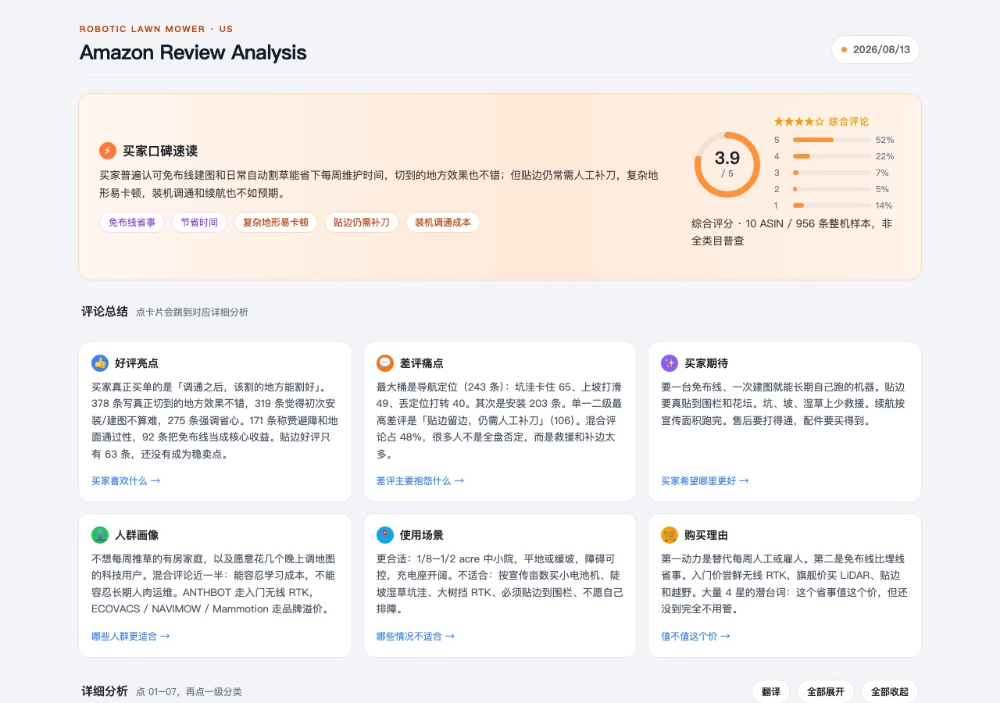
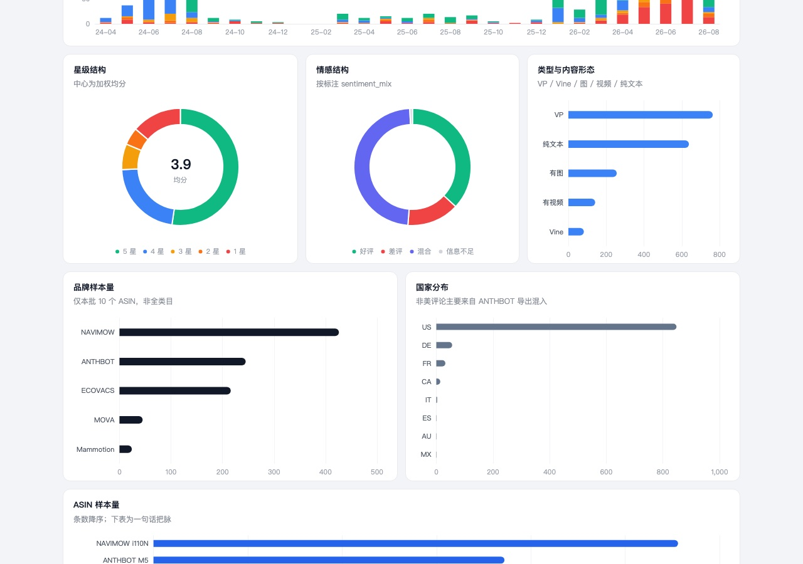
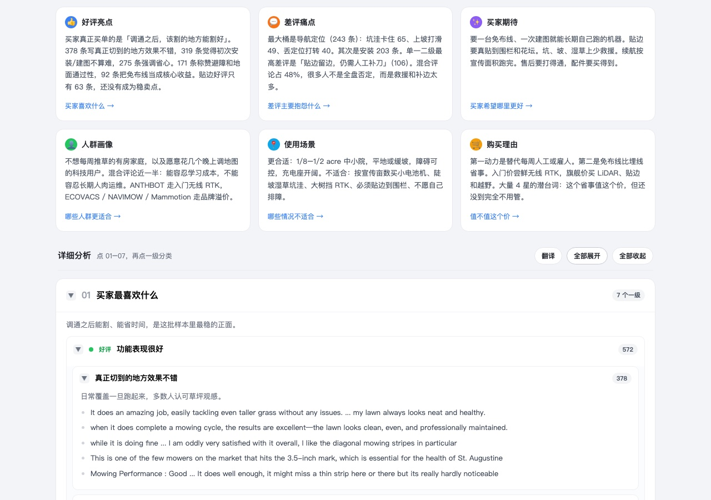

# Amazon Review Analysis Skill

[](LICENSE)
[](requirements.txt)
[](https://github.com/CoderAndyLee/amz-review-analysis-skill/stargazers)
[](#%E7%A4%BE%E5%8C%BA%E4%BA%A4%E6%B5%81)

把卖家精灵导出的 **产品表 + Review 表**，整理成一套可复用的 Agent Skill：分类体系会在分析过程中逐步生长，单元格保留买家原文摘录，最终输出交互式 HTML 看板和交付 Excel。

> 作者：[Andy聊跨境](https://www.amzandy.cn) · 微信 `andylee610`（备注 Review Skill）
>
> GitHub 下载慢？可使用 [备用下载地址](https://amzandy.cn/resources?resource=0ea6e88d-2e5c-454f-88a6-af253cf1ac9c)。

[安装与使用](#安装与使用) · [目录约定](#目录约定) · [Demo 与边界](#demo-与边界) · [社区交流](#社区交流) · [版权与使用范围](#版权与使用范围)



当前 Demo 来自美区 Robotic Lawn Mower，已下载 **10 个整机 ASIN，主分析 956 条 Review**。这是方法演示，不代表全美类目普查。

## 这套 Skill 能稳定输出

1. **标注总表**：自动生长一级 / 二级 / 三级分类列，单元格保留买家原话
2. **层级透视**：从极性逐层下钻到一级、二级、三级分类和原声摘录
3. **交互式 HTML 看板**：包含口碑速读、六张总结卡、详细分析 01–07，以及月度 1–5 星趋势



## 安装与使用

### 1. 准备环境

需要 Python 3.10+，以及一个能加载 Skill 的 Agent（如 Grok、Claude Code 或同类工具）。

### 2. 下载并安装依赖

```bash
git clone https://github.com/CoderAndyLee/amz-review-analysis-skill.git
cd amz-review-analysis-skill
pip install -r requirements.txt
```

不方便使用 Git clone，也可以直接下载 [Releases](https://github.com/CoderAndyLee/amz-review-analysis-skill/releases) 中的 zip，或使用 [备用下载地址](https://amzandy.cn/resources?resource=0ea6e88d-2e5c-454f-88a6-af253cf1ac9c)。

### 3. 加载 Skill

以 Grok 为例，链接到其 skills 目录：

```bash
ln -s "$(pwd)" ~/.grok/skills/amz-review-analysis
```

Claude Code 则链接到项目内的 `.claude/skills/amz-review-analysis`。

### 4. 开始分析

对 Agent 说：

> 按 amz-review-analysis 做这个类目。输入在 `1 Products` 和 `2 Reviews`。

## 目录约定

```text
<类目>/
  1 Products/     BSR 或选品表
  2 Reviews/      每个 ASIN 一份卖家精灵 xlsx
  3 Data/         reviews_master.xlsx（脚本写）
  4 Reports/      HTML + board-data.js + 交付 xlsx
  5 Work/         波次 JSONL、近义合并表
```

空骨架在 `templates/category-folder/`。

## 脚本

| 脚本 | 作用 |
| --- | --- |
| `scripts/merge_reviews.py` | 合并多份 Review，回挂产品，回填 Listing，添加旗标 |
| `scripts/sample_reviews.py` | 按品牌 × 星级抽取第 1 波样本 |
| `scripts/apply_annotations.py` | 将 JSONL 回写总表，持续生长分类列 |
| `scripts/export_pending.py` | 导出未标注行 |
| `scripts/merge_columns.py` | 合并近义列并迁移摘录 |
| `scripts/taxonomy_stats.py` | 统计一级 / 二级分类频次 |
| `scripts/build_delivery.py` | 生成交付 Excel、完整 `board-data.js`，并复制看板 HTML |

出板示例：

```bash
python scripts/build_delivery.py \
  --master "<cat>/3 Data/reviews_master.xlsx" \
  --out-dir "<cat>/4 Reports" \
  --category "Robotic Lawn Mower" \
  --marketplace US \
  --date 2026/08/13
```

方法内核见 [`references/taxonomy-protocol.md`](references/taxonomy-protocol.md) 和 [`references/guide.md`](references/guide.md)，看板约定见 [`references/product-dev-spec.md`](references/product-dev-spec.md)。

## Demo 与边界



打开 [`examples/robotic-lawn-mower/review-analysis.html`](examples/robotic-lawn-mower/review-analysis.html) 查看完整 Demo（需能访问 ECharts CDN）。

- 默认只显示英文原话，点「翻译」出中文
- 07 是改进思路 / 新品方向，不是差评复读
- 样本缺口写在页头：缺 Greenworks C30Z、缺 WORX 头部机

仓库 **不包含** 原始 Review xlsx、评论人姓名或工作底稿，这些内容需要由使用者自行提供并保管。

## 你需要自备

- 卖家精灵产品表 + 按 ASIN 导出的 Review 表
- 一个能跑 Skill 的 Agent
- LLM 额度（几百到上千条长评，别拿小模型硬扛）

本仓库不提供爬虫，也不代替 Shulex 做 30 秒扫盘。Shulex 适合快速看结构，这套 Skill 用于下钻买家原话。

## 社区交流

遇到使用问题、类目特例，或想看其他类目的分析过程，都欢迎来交流。添加个人微信请备注 **Review Skill**。

<table>
  <tr>
    <td align="center" width="50%">
      
    </td>
    <td align="center" width="50%">
      
    </td>
  </tr>
  <tr>
    <td align="center" width="50%">
      <strong>个人微信</strong><br />
      <code>andylee610</code>（备注 Review Skill）
    </td>
    <td align="center" width="50%">
      <strong>公众号</strong><br />
      ANDY聊跨境
    </td>
  </tr>
  <tr>
    <td align="center" width="50%">
      
    </td>
    <td align="center" width="50%">
      
    </td>
  </tr>
  <tr>
    <td align="center" width="50%">
      <strong>跨境 AI 交流群</strong><br />
      扫码加入交流群
    </td>
    <td align="center" width="50%">
      <strong>博客官网</strong><br />
      <a href="https://www.amzandy.cn">amzandy.cn</a>
    </td>
  </tr>
</table>

> 群二维码有效期较短。如已过期，请添加个人微信并备注「进群」。

其他入口：[博客 www.amzandy.cn](https://www.amzandy.cn) · [知无不言 @Andy聊跨境](https://www.wearesellers.com/people/Andy%E8%81%8A%E8%B7%A8%E5%A2%83) · [GitHub @CoderAndyLee](https://github.com/CoderAndyLee)

## 友情链接

跨境与 AI 方向的实用站点，按需取用。如需互换友链，可以通过微信联系。

| 站点                                   | 简介                                                          |
| -------------------------------------- | ------------------------------------------------------------- |
| [Andy聊跨境](https://www.amzandy.cn)    | 作者博客：选品、广告、AI 落地的实战长文                       |
| [DeepSeller](https://www.deepseller.cn) | AI 赋能的跨境电商解决方案：工具、课程与卖家社群               |
| [DEEPAMZ](https://www.deepamz.com)      | AI 赋能的跨境电商解决方案：工具、课程与卖家社群（亚马逊方向） |

## 版权与使用范围

Copyright © 2026 Andy（CoderAndyLee / Andy聊跨境）。保留所有权利。

**可以：**

- 个人学习
- 自己店铺、自己团队内部使用
- 保留作者信息和本声明的前提下转发、收藏、二次开发自用

**不可以（未获书面授权一律禁止）：**

- 服务商、代运营、培训机构、咨询公司拿去 **转卖、改名贴牌、打包进付费课 / 知识星球 / 交付包**
- 把本 Skill 或看板当成你的「自研产品」对外收费
- 删除作者、微信、博客、版权声明后再分发
- 洗稿、镜像成「全宇宙第一的某某 Skill」去引流割韭菜

开源是为了让卖家自己用起来，不是给中介补货架。
如需商业合作、内训授权或二次分发，请通过微信获取正式授权。

> 本项目对个人学习和团队内部使用 **完全免费**。如果有人向您收费出售，请拒绝交易，欢迎把情况反馈给作者。

完整条款见 [LICENSE](LICENSE)。欢迎 issue / PR。分类协议有争议时，先对照 `references/`，不要另起一套树。
